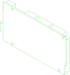

# /pub/electronics/sbcs/arduino

Arduino

## Parts

### mega2560
<table><tr>
<td valign=top></td>
<td valign=top>Arduino Mega 2560 Rev3</td>
</tr></table>

### unoR3
<table><tr>
<td valign=top></td>
<td valign=top>Arduino Uno Rev3</td>
</tr></table>

*Generated by [PartCAD](https://partcad.org/)*
